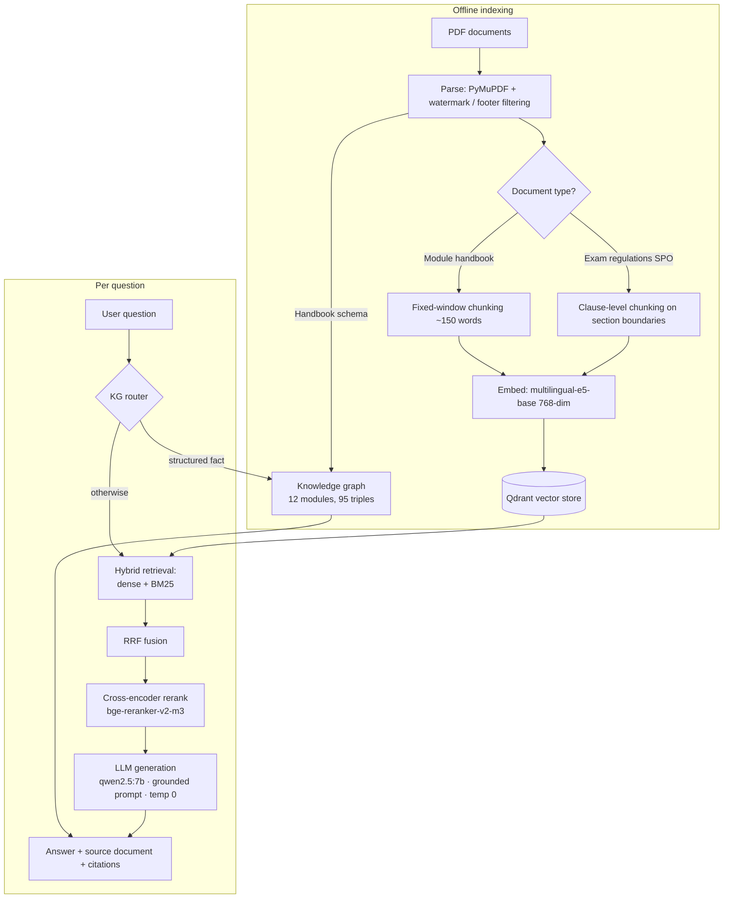

# Aalen Student Assistant — Grounded RAG over University Documents

A retrieval-augmented question-answering system over Hochschule Aalen's Master's **module handbook** and **exam regulations (SPO)**. It combines hybrid retrieval, cross-encoder reranking, and a knowledge-graph layer for structured facts, and it answers questions strictly from the source documents — citing where each answer came from and refusing when the answer isn't there.


---

## Why this exists (and why not just paste the documents into an LLM?)

You could paste one short document into ChatGPT and ask questions. That stops working the moment a real use case appears:

- **Scale.** A university's documents run to hundreds of pages across many files. They don't fit in a context window, and re-sending them on every question is slow and expensive. This system embeds the corpus once and retrieves only the few relevant passages per question, so cost and latency stay flat as the corpus grows (sub-linear vector search + constant LLM context).
- **Grounding you can verify.** A raw LLM blends the document with its training data and hallucinates confidently. This system cites the exact source passage for every answer and says *"I don't have that information"* when the documents don't cover the question (measured 100% refusal accuracy on out-of-scope questions).
- **Precision on structured facts.** Even when handed the context, LLMs confuse adjacent entities (e.g. which module a given professor manages). A knowledge-graph layer binds facts to entities and returns the exact fact deterministically — something context-stuffing can't guarantee.

In short: grounded, scalable, auditable, and current — none of which pasting into an LLM provides.

---

## What it does

- Answers natural-language questions (English **and** German) about modules, credits, exam formats, professors, thesis rules, retake policies, deadlines, and more.
- Draws answers from **two structurally different documents** — a tabular module handbook and a dense legal regulations text — and tells you which document each answer came from.
- Routes structured, fact-lookup questions ("who teaches X?", "how many credits is Y?") through a **knowledge graph** for exact answers, and everything else through the retrieval pipeline.
- Refuses to answer questions outside the documents' scope instead of making things up.

---

## Architecture



---

## How it works

1. **Parsing.** PDFs are extracted with PyMuPDF. A rotated-text filter removes diagonal watermarks (detected via each line's writing-direction vector), and regex filters strip repeating footers and page numbers.
2. **Per-document-type chunking.** The handbook's short labelled fields use fixed-size word windows. The regulations — dense legal prose — are split on `§` section boundaries and then into their numbered clauses, so each chunk holds one complete rule instead of half of one.
3. **Embedding & storage.** Chunks are embedded with the multilingual E5 model (so English questions can match German passages) and stored in Qdrant for fast nearest-neighbour search.
4. **Hybrid retrieval.** Dense (semantic) and BM25 (keyword) retrieval run in parallel and are merged with Reciprocal Rank Fusion, which combines rankings without caring about the two retrievers' incompatible score scales.
5. **Reranking.** A cross-encoder re-scores the fused candidate pool by true query–passage relevance — the two-stage "fast recall, then precise reranking" pattern used in production search.
6. **Knowledge-graph routing.** For questions that map to a structured fact, a router looks the fact up directly in the graph (entity + attribute detection, with guards to decline out-of-scope lookups) and skips retrieval entirely. Everything else falls back to the retrieval pipeline.
7. **Grounded generation.** The LLM answers only from the retrieved context, cites sources, and refuses when the context doesn't answer the question. Generation runs at temperature 0 so answers are reproducible.

---

## Evaluation

The system is measured against a hand-verified gold set (62 questions across both documents, including refusal tests), scored automatically by keyword coverage for answerable questions and refusal detection for out-of-scope ones. Everything runs deterministically (temperature 0), so results are reproducible.

The development followed a **measure → diagnose → fix → re-measure** loop:

| Stage | Corpus | Questions | Accuracy | What changed |
|---|---|---|---|---|
| Dense-only baseline | 1 doc | 46 | 91.3% | after making the eval deterministic (temp 0) |
| + hybrid retrieval + reranker | 1 doc | 46 | 93.5% | fixed name/keyword retrieval failures |
| + knowledge graph | 1 doc | 46 | 95.7% | fixed entity-attribute binding errors |
| + confidence guards | 1 doc | 46 | 100% | *(noted: the eval set guided development)* |
| **Held-out set** | 1 doc | 12 | **83.3%** | honest generalization estimate on unseen questions |
| **Two documents** | 2 docs | 62 | **85.5%** | added the SPO regulations + clause-level chunking |

**Refusal accuracy: 6/6 (100%)** — the system never invented an answer to an out-of-scope question.

A few deliberately honest points from this process:

- The single-document 100% is reported with the caveat that the eval set guided development — so a **held-out set (83.3%)** is the trustworthy generalization number.
- Adding a second document *dropped* accuracy at first (cross-document retrieval interference), which was expected and informative — a bigger corpus forces retrieval to actually discriminate. Diagnosing that interference and fixing it with clause-level chunking is where most of the engineering value lives.
- Upgrading the local model from 3B to 7B did **not** raise the score — which localized the remaining bottleneck to *retrieval*, not generation. (The bigger model does behave more honestly: it refuses bad context instead of hallucinating around it.)

---

## Key engineering decisions

- **Multilingual embeddings** (`multilingual-e5-base`) so English questions retrieve German passages — essential for international students and German source documents.
- **Reciprocal Rank Fusion** instead of summing retriever scores, which live on incompatible scales.
- **A cross-encoder reranker** as a precision second stage over the fast first-stage pool.
- **A knowledge graph for structured facts**, because similarity search is weak at binding a fact to the specific entity asked about — while structured triples bind them by construction. Structured extraction (not statistical NER) was the right tool for the handbook's fixed schema.
- **Per-document-type chunking** — one strategy does not fit all document types. Tabular fields and legal prose need different splitting.
- **A thin, swappable LLM wrapper** so the generation model can change with a one-line config edit (local Ollama in development, a hosted API for production).
- **Temperature 0** for a factual assistant — reproducible answers and a stable evaluation.

---

## Tech stack

| Layer | Choice |
|---|---|
| PDF parsing | PyMuPDF |
| Embeddings | `intfloat/multilingual-e5-base` (sentence-transformers) |
| Vector store | Qdrant (Docker) |
| Keyword retrieval | `rank_bm25` |
| Reranker | `BAAI/bge-reranker-v2-m3` |
| LLM | `qwen2.5:7b` via Ollama |
| Knowledge graph | structured extraction → JSON triples |
| API | FastAPI |
| UI | Streamlit |
| Language / env | Python 3.13, venv, Git |

---

## Setup

**Prerequisites:** Python 3.11+, Docker, and [Ollama](https://ollama.com/).

```bash
# 1. Clone and create an environment
git clone https://github.com/Aryan2033/rag-assistant.git
cd rag-assistant
python3 -m venv venv && source venv/bin/activate
pip install -r requirements.txt

# 2. Start the vector database
docker run -d -p 6333:6333 -p 6334:6334 --name qdrant qdrant/qdrant

# 3. Pull the local LLM
ollama pull qwen2.5:7b

# 4. Add source PDFs to data/raw/ then build the index and knowledge graph
python src/ingest/parse.py
python src/ingest/chunk.py
python src/ingest/embed_index.py
python src/kg/build_kg.py
```

**`requirements.txt`:**

```
pymupdf
trafilatura
sentence-transformers
qdrant-client
rank_bm25
ollama
fastapi
uvicorn[standard]
streamlit
requests
```

## Running

```bash
# Terminal 1 — API
uvicorn src.api.main:app --reload --port 8000

# Terminal 2 — UI
streamlit run ui/app.py       # opens http://localhost:8501
```

Ask a structured question ("Who teaches Natural Language Processing?") to see the knowledge-graph path, and a regulations question ("How many times can I retake a failed exam?") to see the retrieval path — each answer shows its source document and how it was produced.

## Evaluate

```bash
python src/eval/run_eval.py        # full gold set + scorecard
python src/eval/run_heldout.py     # held-out generalization test
```

---

## Project structure

```
rag-assistant/
├── data/
│   ├── raw/            # source PDFs
│   ├── processed/      # cleaned text, chunks
│   ├── kg/             # knowledge-graph triples
│   └── eval/           # gold + held-out question sets
├── src/
│   ├── ingest/         # parse, chunk (per-doc-type), embed + index
│   ├── retrieval/      # dense, bm25, hybrid fusion, reranker
│   ├── kg/             # graph build + query router
│   ├── generation/     # LLM wrapper + grounded answer pipeline
│   ├── eval/           # gold set + evaluation harness
│   ├── api/            # FastAPI backend
│   └── config.py       # single source of truth for settings
├── ui/                 # Streamlit front-end
└── README.md
```

---

## Limitations & future work

Stated honestly, because knowing the edges of a system matters:

- **Cross-document interference remains partial.** The handbook can still crowd the candidate pool on some regulation questions; the reranker usually recovers, but source-balanced retrieval would help further.
- **No numerical aggregation.** The system retrieves and looks up facts but does not compute (e.g. "total workload hours" = class + self-study). Comparison/aggregation questions are out of scope.
- **The knowledge graph is schema-specific.** It exploits the handbook's fixed structure; other document types are retrieval-only unless a dedicated extractor is added.
- **The eval set guided development**, so the two-document 85.5% is best read alongside the held-out result. A larger, independently authored test set would give a tighter generalization estimate.
- **Local model quality.** Development uses a 7B local model; a hosted frontier model would improve answer fluency on dense legal passages.

Planned: source-balanced retrieval, LLM-based relevance verification for refusals, more real institutional documents, and a live hosted demo.

---

## What this project demonstrates

Beyond the feature list, the work shows a full engineering loop: building a working end-to-end system first, then measuring it, diagnosing specific failures to their root cause, fixing them, and re-measuring — with honest accounting of what worked, what didn't, and what the system still can't do.

---

*Built by Aryan Jadhav — M.Sc. Machine Learning & Data Analytics, Hochschule Aalen.*
